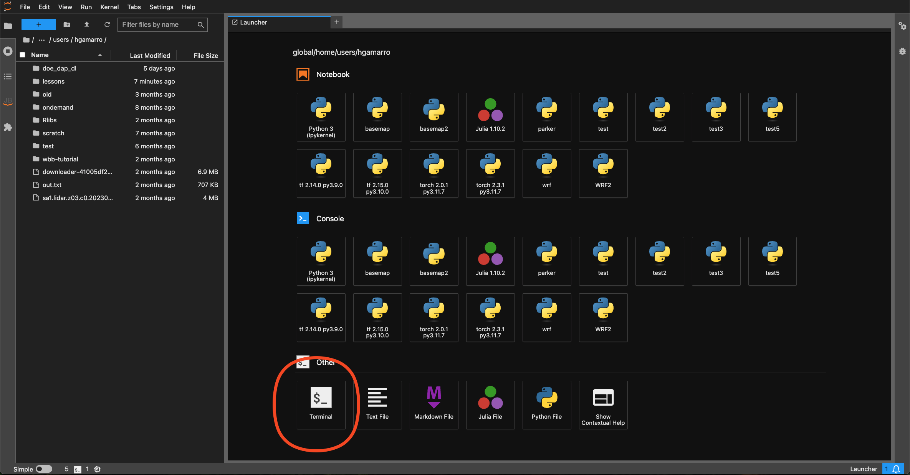
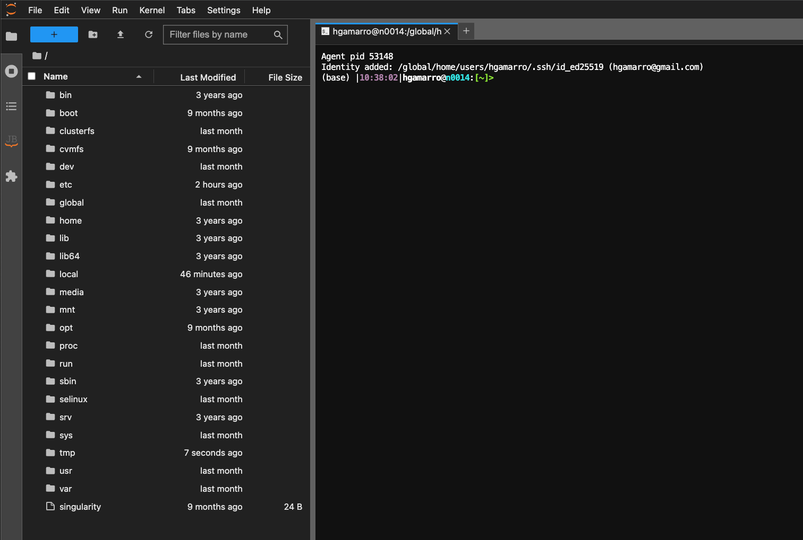
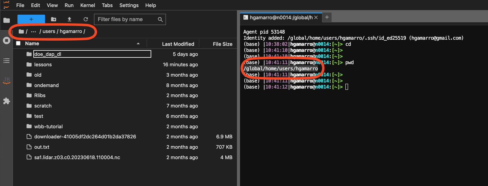
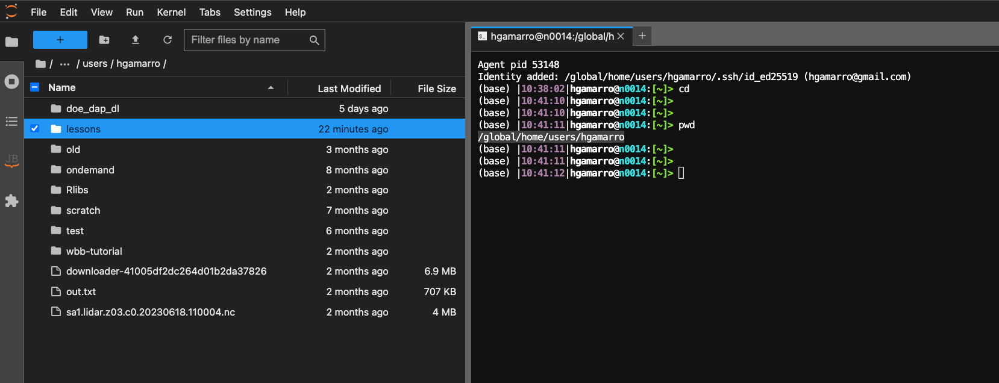
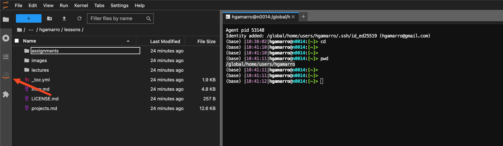
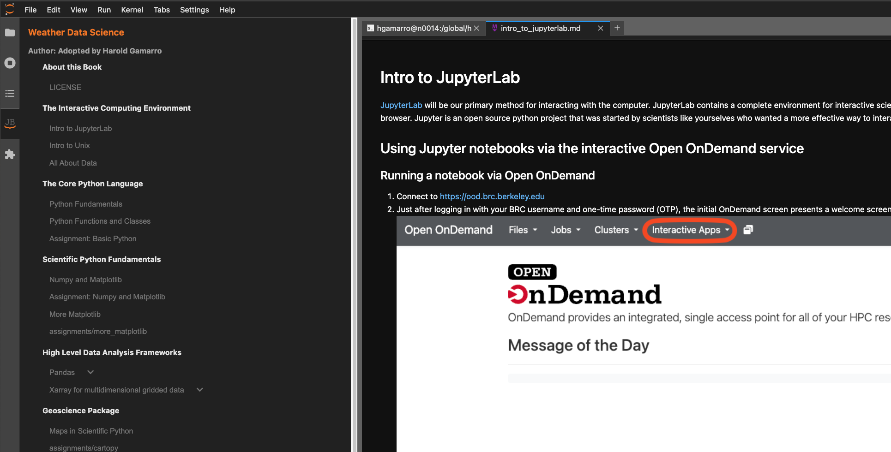
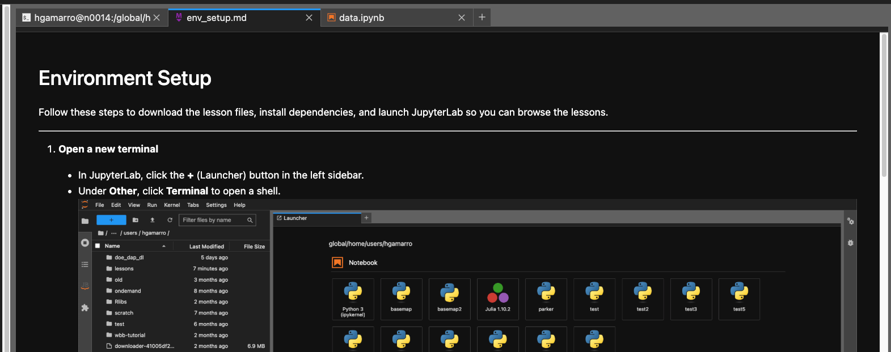
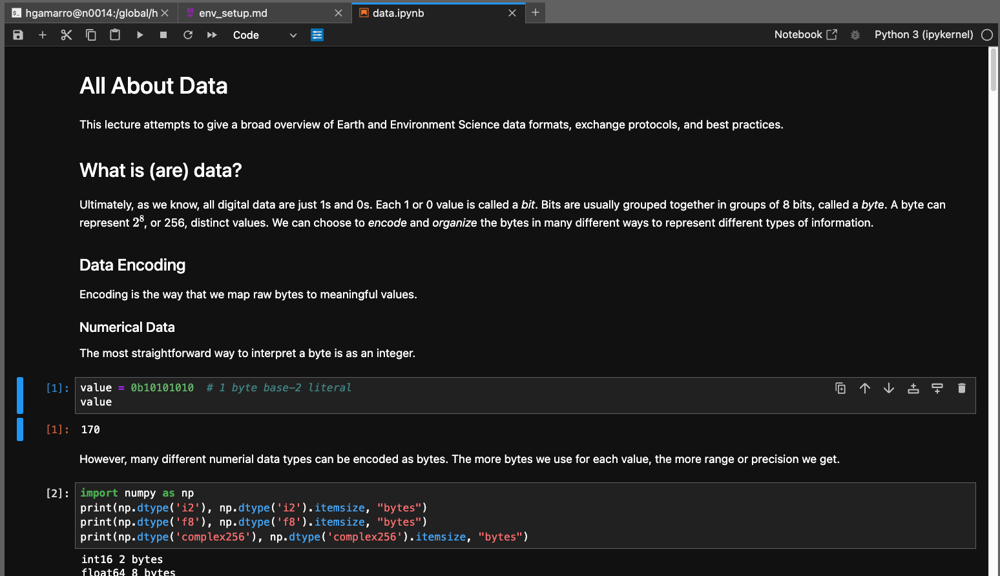

## Environment Setup

Follow these steps to download the lesson files, install dependencies, and launch JupyterLab so you can browse the lessons.

---
1. **Open a new terminal**  
   - In JupyterLab, click the **+** (Launcher) button in the left sidebar.  
   - Under **Other**, click **Terminal** to open a shell.


   - **Note:** The terminal often starts at the server’s root (`/`). You need to move into your working folder and tell JupyterLab where to look, in the new terminal window paste the following:
     ```bash
     cd   # change into your main working directory
     pwd  # print the full path, e.g. /global/home/users/hgamarro
     ```
   - In JupyterLab’s top menu, go to **File → Open From Path**, then paste the output of `pwd`. This will point your File Browser at the correct directory.


2. **Download the lessons repository**
- In the new terminal window paste the following 
```bash
cd
git clone https://github.com/hgamarro/wrf-docs.git
mv wrf-docs/src/ lessons
rm -rf wrf-docs
rm lessons/LICENSE.md lessons/eeds-logo.png
```

3. **Install the JupyterLab notebook-viewer extension**  
```bash
jupyter labextension install jupyter-notebook-lab-extension
```
This extension adds a **Table of Contents** panel for any folder of notebooks. Once it’s installed:

1. In the **File Browser**, navigate into the `lessons/` folder.  
2. Open the **Table of Contents** side-panel (click the “JB” icon in the left sidebar).  
3. Click any lesson title in the **Table of Contents** to jump to that notebook.




> **Note:**  
> - If the lesson you open is a **Markdown file** (`.md`), you’ll probably need to use the **Terminal** for the lesson 
> - If the lesson is a **Notebook** (`.ipynb`), you can open and interact with it directly in JupyterLab.  





<!-- 3. **Install required Python packages**  
```bash
conda install -c conda-forge \
  numpy \
  pandas \
  matplotlib \
  xarray \
  netcdf4 \
  -y
``` -->


